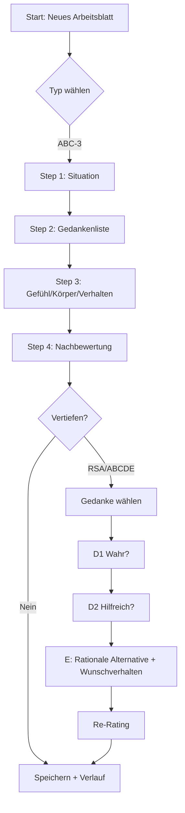
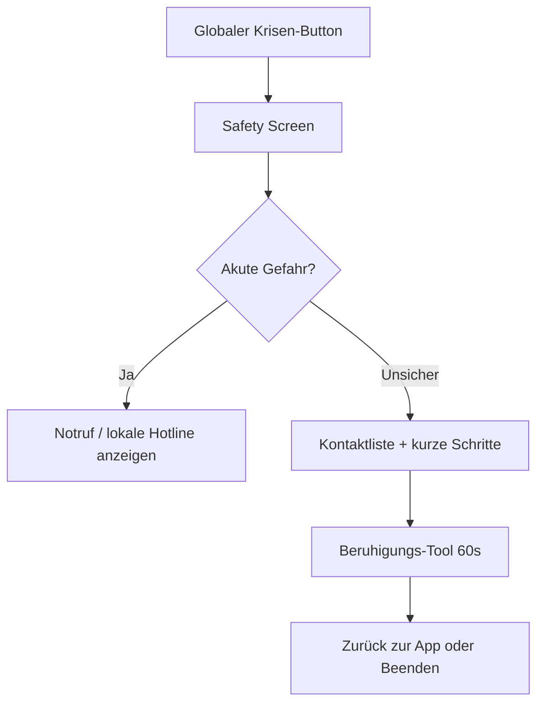
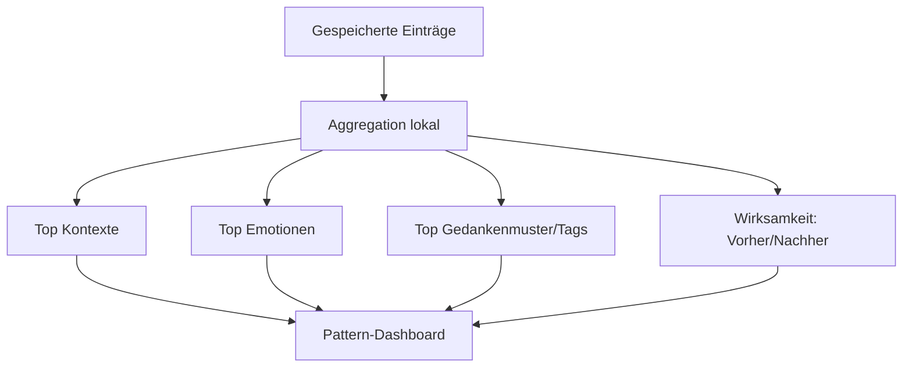

# Digitale Arbeitsblatt-App für ABC-3, Rationale Selbstanalyse und Depressions-Skala

## Executive Summary

Die fotografierten Arbeitsblätter bilden mit hoher Wahrscheinlichkeit eine **REBT/CBT‑artige ABC(D)E‑Kette** ab: **A** (Auslöser/Situation) → **B** (Bewertung/Gedanken) → **C** (Konsequenzen: Gefühl/Körper/Verhalten) plus **D** (prüfende „Wahr?/Hilfreich?“-Disputation) und **E** (rationale Alternative & gewünschte Reaktion). Diese Struktur ist im IBT‑Kontext explizit als „ABC‑Modell“ und „Rationale Selbstanalyse (RSA)“ beschrieben und wird als Kernbaustein kognitiver Umstrukturierung verwendet. citeturn14view0turn1view0

Wichtigster Realitätscheck: **„Arbeitsblätter einfach als App verpacken“ ist rechtlich nicht automatisch möglich.** Sowohl das IBT‑Material (Kohlhammer) als auch die UP/Hogrefe‑Arbeitsblätter und die Depressionsskala (ODSIS/UP) sind **urheberrechtlich geschützt**; das IBT‑Buch nennt explizit das Verbot der „Einspeicherung und Verarbeitung in elektronischen Systemen“ ohne Verlagszustimmung sowie Einschränkungen für die Zusatzmaterialien. citeturn1view0turn22view0turn4view0

Der sinnvollste Weg für ein MVP ist daher: **eine eigenständige, inhaltlich kompatible digitale Arbeitsblatt‑Engine** (keine 1:1‑Kopie von Layout/Text), die die *Feldlogik* abbildet und später bei vorliegenden Rechten „offizielle“ Templates freischalten kann. Diese Engine kann lokal‑first und ohne KI funktionieren und entspricht zugleich den Best‑Practices aus digitalen Thought‑Record‑Apps und der Forschung zu „digitized thought records“ (insb. Schrittführung, geringes Cognitive Load, Export/Review‑Optionen, starke Datenschutz‑Defaults). citeturn15view0turn12view0turn10search1

Die Roadmap sollte zwingend mit **Rechteklärung** und einer **„No‑medical‑claims“‑Positionierung** starten (sonst rutscht das Produkt schnell in Medizinprodukt/DiGA‑Anforderungen). Für die spätere DiGA‑Migration brauchst du dann CE‑Kennzeichnung + Evidenz + sehr strenge Datenschutz-/Sicherheitsnachweise; das BfArM beschreibt u. a. den Fast‑Track mit 3‑Monats‑Bewertungszeit und ein umfangreiches Anforderungsprofil. citeturn16view0turn13search1turn13search2

## Quellen- und Lizenzanalyse

### Primärquellen der fotografierten Blätter

**IBT / „Individualisierte Burnout‑Therapie (IBT)“**  
Autor: **entity["people","Gert Kowarowsky","psychotherapist author ibt"]**. Verlag: **entity["company","W. Kohlhammer GmbH","book publisher germany"]**. 1. Auflage 2017. citeturn1view0turn23view0  
Im Buch‑Vorab‑PDF steht eine klassische Urheberrechtsklausel (u. a. Verbot von Vervielfältigung/elektronischer Verarbeitung ohne Zustimmung) und zusätzlich ein Hinweis: Die im Downloadbereich bereitgestellten Arbeitsmaterialien sind urheberrechtlich geschützt und nur für **persönlichen, nicht‑gewerblichen Gebrauch** erlaubt; die Nutzung außerhalb der Grenzen des Urheberrechts (inkl. elektronischer Verarbeitung) bedarf der Zustimmung. citeturn1view0  
Inhaltlich wird IBT als multimodaler Ansatz beschrieben, basierend auf **kognitiver Verhaltenstherapie**, **Rational‑Emotiver Verhaltenstherapie (REVT/REBT)** und **Motivational Interviewing**; als Baustein wird explizit die **kognitive Umstrukturierung „durch die Rationale Selbstanalyse“** genannt. citeturn1view0turn23view0

**IBT‑Modulbeschreibung (Sekundärquelle, deutschsprachig, aber inhaltlich nah am Manual)**  
Ein deutschsprachiger Fachartikel beschreibt IBT‑Module; darin wird „Modul 3: ABC‑Modell und Rationale Selbstanalyse (RSA)“ explizit benannt und als zentrale Psychoedukation die Fragen „Wahr?“ und „Hilfreich?“ (plus Perspektivwechsel‑Fragen) dargestellt. citeturn14view0  
Das ist praktisch die textliche Entsprechung zu den fotografierten D/E‑Blättern (Disputation + gewünschte Reaktion).

**UP/Unified Protocol Arbeitsbuch (deutsche Ausgabe)**  
Das fotografierte Depressionsformular nennt **Hogrefe** als Herausgeber/Verlag der deutschsprachigen Ausgabe des Unified Protocol Arbeitsbuchs („Transdiagnostische Behandlung emotionaler Störungen“). Der Hogrefe‑Shoplistung zufolge: Arbeitsbuch (1. Aufl. 2019, ISBN 978‑3‑456‑85241‑6) von **entity["people","David H. Barlow","clinical psychologist"]** et al., herausgegeben von **entity["people","Franz Caspar","psychologist editor"]**, mit „zahlreichen Selbsttests, Übungsblättern“. citeturn18view0turn0search6  
Hogrefe stellt einzelne Arbeitsblätter als Download bereit, mit Copyright‑Hinweis auf das Arbeitsbuch. citeturn4view0

### Identifikation der Depressionsskala

Die fotografierte „Depressions‑Skala“ entspricht in Struktur und Antwortformat sehr wahrscheinlich der **ODSIS (Overall Depression Severity and Impairment Scale)**: 5 Items, Rückblick „letzte Woche“, Ratings 0–4 zu Häufigkeit/Intensität und Beeinträchtigungen (Aktivitäten, Arbeit/Schule/Haushalt, soziale Beziehungen). Diese Itemstruktur ist in einem OUP‑PDF zur UP‑Materialsammlung ersichtlich; dort ist auch ein Copyright‑Vermerk von **entity["company","Oxford University Press","academic publisher"]** enthalten. citeturn22view0  
Die ODSIS wird als kurzes 5‑Item‑Instrument zur Erfassung von Depressionsschwere und funktioneller Beeinträchtigung beschrieben (u. a. Validierungsarbeit). citeturn6search7turn6search8

### Lizenzstatus und „Darf ich das digitalisieren?“

Hier ist die ernüchternde Kurzfassung:

| Materialblock | Wahrscheinlicher Rechteinhaber | Was in den Quellen explizit zur Nutzung steht | Konsequenz für deine App |
|---|---|---|---|
| IBT‑Arbeitsblätter/Online‑Materialien | entity["company","W. Kohlhammer GmbH","book publisher germany"] und/oder Autor | Verbot der Nutzung außerhalb Urheberrechts, inkl. Speicherung/Verarbeitung in elektronischen Systemen ohne Zustimmung; Downloadmaterial nur persönlich/nicht‑gewerblich. citeturn1view0 | 1:1‑Digitalisierung ist ohne Lizenz riskant. Besser: eigene, inhaltlich kompatible Templates oder Lizenz einholen. |
| Hogrefe UP‑Arbeitsblätter (deutsch) | entity["company","Hogrefe Verlag GmbH & Co. KG","publisher germany"] (plus Originalrechte OUP) | Download‑Arbeitsblatt mit Copyright‑Hinweis auf das Arbeitsbuch. citeturn4view0turn18view0 | Repackaging als App ohne Permission: hohes Risiko. |
| ODSIS (UP‑Material) | entity["company","Oxford University Press","academic publisher"] | OUP‑PDF zeigt Copyright‑Vermerk und vollständige Skala. citeturn22view0 | Nutzung in einer App kann lizenzpflichtig sein; deutsche Übersetzung zusätzlich Hogrefe‑Rechte. Detail „freie Nutzung“: **nicht gefunden/unspezifiziert**. |

**Wie man Permissions realistisch angeht**  
Hogrefe betreibt eine explizite Rights‑&‑Permissions‑Seite inkl. Kontakt der Lizenzabteilung („permissions@…“). citeturn20view1turn20view3  
entity["company","W. Kohlhammer GmbH","book publisher germany"] bietet Kontakt‑/Servicekanäle und „Foreign Rights & Licensing“. citeturn23view0turn21search3turn21search15  
Für dein Projekt bedeutet das: Du brauchst ein **konkretes Nutzungsszenario** (App‑Store Vertrieb? Abo? klinische Nutzung? DiGA‑Ziel?) und musst dann **Nachdruck/elektronische Nutzung** verhandeln – oder konsequent **eigene, nicht‑identische** Arbeitsblatt‑Implementierungen nutzen.

## Kanonische Arbeitsblatt-Templates und therapeutische Logik

### Psychotherapeutische Rationale hinter den Blättern

**ABC‑3 (A‑B‑C mit 3 Konsequenzkanälen)**  
Die gezeigte ABC‑3‑Grafik ordnet „Ereignis/Situation/Mensch“ (A) → „Bewertung/Interpretation/Gedanken“ (B) → „individuelle Reaktionen“ (C) und differenziert C in **Gefühl, Körper, Verhalten**. Das ist textbook‑kompatibel mit CBT/REBT‑Denke: Nicht A „macht“ C, sondern B vermittelt. In IBT wird das ABC‑Modell als eigenes Modul vermittelt. citeturn14view0turn1view0

**RSA / ABCDE‑Erweiterung (Disputation + neue Haltung)**  
Die D‑ und E‑Blätter („Wahr?“, „Hilfreich?“, Perspektivwechsel; danach gewünschtes Fühlen/Körper/Verhalten) sind eine praktisch‑didaktische Ausformung von **Disputation (D)** und **Effective new belief/response (E)**. IBT benennt diese Fragen als Kern der kognitiven Umstrukturierung. citeturn14view0

**Depressions‑Skala als Outcome/Monitoring‑Baustein**  
Die ODSIS‑artige Skala dient nicht der „Selbsttherapie“, sondern der **Symptom‑ und Beeinträchtigungs‑Verlaufsbeobachtung** über Wochen (Kurzzeit‑Tool, wiederholbar). In digitalen Thought‑Record‑Systemen ist gerade diese Outcome‑Schleife oft unvollständig implementiert (z. B. fehlendes Re‑Rating), was als Fidelity‑Problem beschrieben wird. citeturn15view0turn6search8

### Extraktion der fotografierten Templates in kanonische App‑Felder

Die Tabellen unten sind absichtlich **nicht** 1:1 Wortlaut‑Kopien, sondern „feldlogische Templates“, die du digital implementieren kannst, ohne Layout/Text zu klonen.

#### Template A: ABC‑3 Kurzprotokoll

| Papierbereich | Feld (App) | Datentyp | Pflicht? | Validierung/Notes |
|---|---|---:|:---:|---|
| A: „Was ist passiert?“ | `situation.description` | Text | ✓ | 3–500 Zeichen |
| A: Kontext/Ort/Person(en) | `situation.context` | Enum + optional Text | ○ | Kontexte als Chips; freie Ergänzung optional |
| A: Datum/Zeit | `situation.timestamp` | DateTime | ✓ | Default: jetzt; editierbar |
| B: „Worüber war ich ärgerlich/traurig…“ (Gedankenliste) | `beliefs[]` | Array(Text) | ✓ | min. 1, max. 10; je 1–200 Zeichen |
| C1: Gefühl(e) | `consequence.emotions[]` | Enum + Intensität | ✓ | Emotion‑Chips + 0–10 Slider |
| C2: Körperreaktion | `consequence.body_signals[]` | Multi‑Select | ○ | Liste: Puls, Schwitzen, Druck, etc + Freitext |
| C3: Verhalten | `consequence.behavior` | Enum + Text | ○ | „gehandelt / vermieden / gegrübelt / geschrieben“ + Notiz |

#### Template B: RSA/ABCDE‑Arbeitsblatt

| Papierbereich | Feld (App) | Datentyp | Pflicht? | Hinweise |
|---|---|---:|:---:|---|
| A: Ausgangssituation | `rsa.a.description` | Text | ✓ | identisch zu ABC‑A, aber eigener Entry‑Typ möglich |
| B: Bewertungen/Gedanken (B1..Bn) | `rsa.b.thoughts[]` | Array(Obj) | ✓ | pro Gedanke eigener Disputations‑Subflow |
| C1: Gefühl | `rsa.c.emotion_primary` | Enum | ✓ | 1 Hauptemotion; optional Sekundär |
| C1: Intensität | `rsa.c.emotion_intensity` | Int | ✓ | 0–10 |
| C2: Körper | `rsa.c.body_intensity` | Int | ✓ | 0–10 |
| C3: Verhalten | `rsa.c.behavior_observed` | Enum/Text | ○ | was getan wurde |
| D1 „Wahr?“ | `rsa.d.truth_check` | Enum + Text | ✓ | Ja/Nein + Begründung kurz |
| D2 „Hilfreich?“ | `rsa.d.usefulness_check` | Enum + Text | ✓ | Ja/Nein + warum |
| D‑Perspektive (Freund / souveräne Person) | `rsa.d.perspective_prompts[]` | Array(Text) | ○ | kurze Antworten, 0–300 |
| E1 gewünschtes Fühlen | `rsa.e.desired_emotion` | Enum + Intensity | ✓ | Zielzustand, nicht „immer positiv“ |
| E2 gewünschter Körperzustand | `rsa.e.desired_body` | Enum/Text | ○ | „ruhiger“, „weniger angespannt“ |
| E3 gewünschtes Verhalten | `rsa.e.desired_behavior` | Enum/Text | ✓ | konkrete „If‑Then“ Option |
| D1‑Alternative (rationale Alternative) | `rsa.e.rational_alternative` | Text | ✓ | 1–300 Zeichen |

#### Template C: ODSIS‑artige Depressions‑Skala

| Papierbereich | Feld (App) | Datentyp | Pflicht? | Berechnung |
|---|---|---:|:---:|---|
| Item 1 Häufigkeit | `odsis.i1_frequency` | Int 0–4 | ✓ | |
| Item 2 Intensität | `odsis.i2_intensity` | Int 0–4 | ✓ | |
| Item 3 Interesse/Aktivitäten | `odsis.i3_pleasure_impairment` | Int 0–4 | ✓ | |
| Item 4 Arbeit/Schule/Haushalt | `odsis.i4_role_impairment` | Int 0–4 | ✓ | |
| Item 5 Soziales/Beziehungen | `odsis.i5_social_impairment` | Int 0–4 | ✓ | |
| Gesamt | `odsis.total` | Int 0–20 | auto | Summe der 5 Items |

Hinweis: Das OUP‑Material zeigt die Skala im Kontext des Unified Protocol und weist Copyright aus. citeturn22view0turn18view0  
Für ein MVP ohne Lizenz ist die saubere Option: **eigene Belastungs‑Skala 0–10** nutzen und ODSIS als „späterer, lizenzierter Ersatz“ einplanen.

### Was digitale Adaptionen typischerweise anders machen

Die beiden relevantesten Vergleichspunkte aus existierenden digitalen Implementierungen:

**REBT‑Digitalisierung als Auswahl‑/Dialog‑Flow statt freies Schreiben**  
Das „Smarter Thinking“‑Manual beschreibt eine sehr deterministische UI: Gefühl wählen → Situation wählen → Kernbelief wählen → Disputation in drei Modi (empirisch/logisch/pragmatisch) → rationalen Gegenbelief auswählen → speichern. Das ist exakt der Pattern‑Vorteil digitaler Umsetzung: weniger Tipparbeit, mehr Regel‑Guidance, konsistente Outputs. citeturn12view0

**CBT‑Thought‑Record‑Apps schwanken stark in „Fidelity“ und Datenschutz**  
Eine practitioner‑orientierte Review zu digitized thought records berichtet, dass viele Apps zwar „die meisten Kernelemente“ enthalten, aber bei Sub‑Elementen (z. B. Emotionsintensität re‑raten, Actions planen) stark variieren; außerdem sind starke Datenschutzmechaniken (Login + Verschlüsselung) selten. citeturn15view0  
Konsequenz: Deine App sollte „Fidelity‑komplett“ sein (inkl. Vorher/Nachher‑Ratings) und lokal‑first + App‑Lock „by default“ anbieten.

## Adaptierter App‑Konzeptentwurf

### Produktpositionierung

Eine saubere, rechtlich robuste Positionierung für V1:

- **„Digitale Arbeitsblatt‑Bibliothek für Selbstreflexion und kognitive Umstrukturierung“**
- keine Heilversprechen („Burnout behandeln“, „Depression therapieren“) im Marketing
- klarer Hinweis: kein Notfall‑/Therapieersatz  
Das hält dich außerhalb der schlimmsten regulatorischen Schlinge, solange du nicht in medizinische Zweckbestimmung abrutschst.

### Informationsarchitektur

- **Start**: „Neues Arbeitsblatt“ + „Letzte Einträge“
- **Arbeitsblätter** (Library): ABC‑3, RSA/ABCDE, Verlauf der Emotion (UP‑ähnlich), Belastungs‑Skala (ggf. später ODSIS)
- **Tools** (kurz): Atemtimer, Boden‑/5‑Sinne‑Übung (optional Audio), „Nicht senden“‑Impulspause
- **Verlauf**: Liste, Detailansicht, Export (später)
- **Muster**: häufige Auslöser, häufige Gedankenarten, häufige Emotionen, „Hilft mir?“‑Trefferquote
- **Krise**: Safety‑Screen (statisch), Kontakte, Notfall‑Hinweise
- **Einstellungen**: App‑Lock, Daten löschen, Export, Erinnerungen

### Kernflows als Stepper‑Pattern

Warum Stepper? Weil Arbeitsblätter sonst als „großes Formular“ im Handy‑Format einfach nur nerven.

#### ABC‑3 Flow (Kurz)

- Step 1: Auslöser/Situation (Text + Kontextchips + Zeit)
- Step 2: Gedankenliste (B1…Bn)
- Step 3: Konsequenzen (Gefühl/Körper/Verhalten)
- Step 4: Mini‑Nachbewertung (Belastung 0–10, Klarheit 0–10)
- Step 5: Speichern + optional „Rational prüfen? → RSA starten“

#### RSA/ABCDE Flow (Vertiefung)

- Step 1: Situation recap (A)
- Step 2: 1 Gedanke auswählen (B1)
- Step 3: Disputation (D1 wahr? D2 hilfreich? + Perspektive)
- Step 4: Rationale Alternative (E‑belief) + gewünschtes Verhalten
- Step 5: Re‑Rating (C‑Intensität vorher/nachher)
- Step 6: Nächster Mini‑Schritt

#### Depressions‑Skala Flow

- 5 Items, jeweils 0–4 als große „Radio‑Cards“
- Ergebnis: nur Summenwert + Verlauf (kein Diagnose‑Label)

### UI‑Patterns, die wirklich funktionieren

- **Chips statt Tastatur** für Kontext/Emotion/Verhalten
- **Skalen als große vertikale Cards** (0–4, 0–10) statt Slider‑Fiddling
- **Kurze Textfelder** (max 200–300 Zeichen) statt Aufsatzmodus
- **„Ein Gedanke pro Screen“** beim D/E‑Teil, sonst Cognitive Overload
- **Optionaler Timer** (Atemkreis 60–90s) als „Pause vor Bewertung“
- **„Save Draft“ automatisch** nach jedem Step (keine Datenverluste im Stress)
- **Export nur bewusst** (PDF/Share später) – nicht automatisch synchronisieren

### Calm UX und Accessibility Mindestanforderungen

- Interaktive Elemente groß genug: Android/Material empfehlen Touch‑Targets mind. 48×48dp. citeturn17search2turn17search12  
- Dynamische Schriftgrößen (iOS Dynamic Type) unterstützen, weil Nutzer in Stress schlechter lesen. citeturn17search1  
- Kontrast zuverlässig (WCAG‑Minimum 4.5:1 für normalen Text) – sonst ist es „Calm UX“ nur im Pitchdeck. citeturn17search17

### Beispielhafte UI‑Mock‑Snippets

```text
[Screen: ABC-3 / Step 1]
Titel: Was ist passiert?
Textfeld: "Kurzbeschreibung"
Chips: Kontext (Arbeit / Beziehung / Gesundheit / Alltag / Social)
Zeit: Jetzt (editierbar)
Button: Weiter

[Screen: ABC-3 / Step 2]
Titel: Welche Gedanken sind aufgetaucht?
Liste B1..Bn (je 1 Zeile)
Button: + Gedanke hinzufügen
Button: Weiter

[Screen: RSA / D1]
Titel: Prüfe den Gedanken
Frage 1: Entspricht das überprüfbaren Fakten?
[ Ja ] [ Nein ]  (große Buttons)
Textfeld: "Warum?"
Button: Weiter

[Screen: RSA / E]
Titel: Rationale Alternative
Textfeld: "Realistischere Alternative"
Chips: Ich möchte mich eher fühlen: (ruhig / traurig aber stabil / ärgerlich aber kontrolliert)
Button: Speichern
```

### Mermaid Flowcharts für die Kernlogik







## Technischer Plan mit Anpassungen an die bisherigen PRD/Tech-Dokumente

### Grundentscheidung: „Worksheet Engine“ statt „Intervention Engine“

Deine bisherigen PRD/Tech‑Pläne (lokal‑first, Flutter, Drift) bleiben sinnvoll. Was sich ändert:

- „Interventions“ sind jetzt primär **Arbeitsblatt‑Templates**  
- „InterventionStep“ wird zu **FormStep** (UI‑Renderer für Felder/Skalen/Chips)
- „StateClassifier“ bleibt, aber wird schlanker: er entscheidet primär **„erst runterregeln?“** und **„Krisenpfad?“** statt „Therapiepfad“.

### Datenmodell-Mapping (Entities)

| Entity | Zweck | Wichtigste Felder |
|---|---|---|
| `WorksheetTemplate` | Definiert Struktur eines Arbeitsblatts | `id`, `type`, `steps[]`, `field_defs[]`, `version`, `license_tag` |
| `WorksheetEntry` | Konkrete Ausfüllung | `id`, `template_id`, `created_at`, `status`, `payload_json`, `derived_metrics_json` |
| `BeliefItem` | Einzelner Gedanke B1..Bn | `id`, `entry_id`, `text`, `ratings_before/after`, `disputation_answers` |
| `OutcomeMeasure` | Skalen wie ODSIS (optional) | `measure_type`, `items[]`, `total`, `timestamp` |
| `UserSettings` | lokal | Reminders, App‑Lock, Export, Sprache |
| `CrisisPlan` | lokal | Kontakte, Schritte, Warnzeichen |

Technisch kannst du das als **Drift‑Tabellen** abbilden, aber mit Payload‑JSON für Flexibilität (Templates entwickeln sich). Das hält Migrationen klein.

### Validierung und Feldlogik

- **Hard validation**: Pflichtfelder, Wertebereiche (0–10, 0–4), max‑Längen.
- **Soft validation**: „du hast 0 Gedanken eingetragen – willst du trotzdem speichern?“
- **Derived metrics**:
  - `delta_emotion_intensity = before - after`
  - `delta_body = before - after`
  - `helpfulness_rate = helpful_yes / all_disputations`
  - `rumination_flag`: wenn Verhalten=Grübeln + wiederholter Kontext

### Regel-Logik für Zustandsklassifikation und „Welches Blatt empfehle ich?“

Minimal, robust, ohne KI:

**Input**:  
- `emotion_intensity (0–10)`, `body_arousal (0–10)`, `behavior_tag`, optional `crisis_flag`

**Output (State)**:  
- `acute_activation` (zuerst Atem/Regulation)  
- `reflective_ready` (direkt RSA möglich)  
- `rumination` (Grübel‑Unterbrechung empfehlen)  
- `crisis` (Safety Screen)  

**Heuristiken Beispiel**:
- Wenn `crisis_flag == true` → `crisis`
- Wenn `emotion_intensity >= 8 OR body_arousal >= 8` → `acute_activation`
- Wenn `behavior_tag in {grübeln, kontrollieren}` und `emotion in {angst, scham}` → `rumination`
- Sonst → `reflective_ready`

Das ist absichtlich simpel: In Stressmomenten ist „komplizierte Entscheidungsmatrix“ nur eine elegante Art zu versagen.

### Beispiel-JSON-Schema für Templates und Entries

```json
{
  "template": {
    "id": "rsa_v1",
    "type": "rsa_abcde",
    "version": "1.0.0",
    "license_tag": "original-inspired-no-copy",
    "steps": [
      {
        "id": "a_situation",
        "title": "Ausgangssituation",
        "fields": [
          { "key": "a.description", "type": "text", "required": true, "maxLen": 500 },
          { "key": "a.context", "type": "chips", "required": false, "options": ["Arbeit","Beziehung","Alltag","Gesundheit","Sonstiges"] },
          { "key": "a.timestamp", "type": "datetime", "required": true }
        ]
      },
      {
        "id": "c_consequence",
        "title": "Reaktion",
        "fields": [
          { "key": "c.emotion.primary", "type": "chips", "required": true, "options": ["Angst","Ärger","Traurigkeit","Scham","Ekel","Freude","Neutral"] },
          { "key": "c.emotion.intensity", "type": "scale", "required": true, "min": 0, "max": 10 },
          { "key": "c.body.intensity", "type": "scale", "required": true, "min": 0, "max": 10 },
          { "key": "c.behavior.tag", "type": "chips", "required": false, "options": ["Angriff","Rückzug","Grübeln","Rechtfertigen","Vermeiden","Gespräch gesucht"] },
          { "key": "c.behavior.note", "type": "text", "required": false, "maxLen": 300 }
        ]
      }
    ]
  },
  "entry": {
    "id": "entry_2026_03_16_120501",
    "template_id": "rsa_v1",
    "created_at": "2026-03-16T12:05:01+01:00",
    "status": "completed",
    "payload": {
      "a": { "description": "…", "context": "Alltag", "timestamp": "…" },
      "b": { "thoughts": [ { "text": "B1 …" }, { "text": "B2 …" } ] },
      "c": { "emotion": { "primary": "Ärger", "intensity": 8 }, "body": { "intensity": 7 } },
      "d": { "truth": { "answer": "no", "note": "…" }, "helpful": { "answer": "no", "note": "…" } },
      "e": { "rational_alternative": "…", "desired_behavior": "Pause + später klären" },
      "rerating": { "emotion_intensity": 5, "body_intensity": 4 }
    },
    "derived_metrics": {
      "delta_emotion": 3,
      "delta_body": 3,
      "state": "reflective_ready"
    }
  }
}
```

### Privacy/Regulatorik: Was du im MVP zwingend richtig machen musst

**Gesundheitsdaten = besondere Kategorie**  
Sobald du emotionale Zustände, depressive Symptome etc. speicherst, bist du faktisch im Bereich „Gesundheitsdaten“; deren Verarbeitung ist nach DSGVO Art. 9 grundsätzlich untersagt, außer es greift eine Ausnahme (typisch: **ausdrückliche Einwilligung**, Datenminimierung, Schutzmaßnahmen). citeturn13search6

**Medizinische Zweckbestimmung vermeiden, wenn du nicht sofort Medizinprodukt sein willst**  
Wenn du den Eindruck erweckst, Krankheiten „zu erkennen, zu behandeln oder zu lindern“, bewegst du dich Richtung Medizinprodukt. Für DiGA müssen Apps in der Regel CE‑gekennzeichnete Medizinprodukte niedriger/mittlerer Klasse sein (BfArM beschreibt DiGA als CE‑Medizinprodukt; typischerweise Klasse I oder IIa). citeturn13search1turn16view0

**DiGA‑Pfad (später)**  
Der BfArM‑Leitfaden beschreibt ein „Fast‑Track“‑Verfahren mit **3 Monaten** Bewertungszeit nach vollständigem Antrag und ein umfassendes Anforderungsprofil. citeturn16view0  
Außerdem werden im Leitfaden konkrete Nachweise zu Datenschutz/Datensicherheit (inkl. zertifizierungsbezogener Anforderungen nach DiGAV) beschrieben, was den Aufwand deutlich oberhalb „normaler App“ hebt. citeturn16view0turn13search4

Pragmatische MVP‑Policy:
- lokal‑first, kein Account, keine Cloud
- optional App‑Lock/biometrisch
- Export nur aktiv durch Nutzer
- klare Krisenhinweise
- keine „Diagnose“‑Labels bei Scores

### Analytics/KPIs ohne Datenschutz-Selbstsabotage

Aus der Forschung zu Thought‑Record‑Apps ist klar: Datenschutzmängel sind verbreitet, obwohl sensibelste Inhalte verarbeitet werden. citeturn15view0  
Konsequenz: MVP‑Analytics sollten standardmäßig **lokal** sein.

Empfohlene KPI‑Sets:

- **Engagement (lokal)**: gestartete Flows, Abschlussrate pro Template, Abbruch‑Step
- **Wirksamkeitsproxys (lokal)**: Δ‑Intensität (vor/nach), Δ‑Körperarousal, Klarheit
- **Qualität**: Anteil „B‑Gedanken“ mit ausgefülltem D/E‑Teil, „Re‑Rating“ Anteil
- **Retention**: 7/30‑Tage Wiederkehr (nur lokal; optional bei Opt‑in anonymisiert)

Optional (später, Opt‑in):
- anonyme Event‑Counts ohne Payload
- Differential Privacy / k‑Anonymität Konzept (bei DiGA‑Ambition ohnehin auditsensibel)

### Test- und Validierungsplan

**Technische Tests (MVP‑Pflicht)**
- Unit: `StateClassifier`, `CrisisDetector`, `TemplateRendererValidator`, `PatternAnalyzer`
- Widget: Stepper‑Navigation + Draft‑Autosave; Skalen‑UI; Chips‑Selektoren
- Integration: kompletter ABC‑3 Flow → speichern → Verlauf öffnen → löschen

**Inhaltliche Validierung (ohne Kliniksiegel, aber seriös)**
- 2–3 approbierte Psychotherapeut:innen reviewen: Feldlogik, Tonalität, Risiko‑Hinweise
- 5–10 Nutzer:innen Think‑Aloud‑Tests: „findet man den nächsten Schritt?“
- Screening auf Dark Patterns (Reminder, Streaks, Schamtrigger)

**Klinische Validierung (DiGA‑Pfad)**
- Outcome‑Definition: z. B. Veränderung in Belastung/ODSIS‑ähnlichen Scores (lizenzabhängig)
- Pilotstudie (Feasibility) → dann RCT/vergleichende Studie gemäß BfArM‑Erwartung (Details im Leitfaden) citeturn16view0

## Roadmap, Risiken und nächste Schritte

### Implementierungsroadmap mit Deliverables und Tests

| Meilenstein | Deliverables | Tests/Checks |
|---|---|---|
| Rechteklärung | Liste aller Templates + Rechtebedarf; Kontaktaufnahme zu Hogrefe/Kohlhammer; Entscheidung „eigene Templates“ vs Lizenz | juristischer Review (kurz) |
| MVP Core | Flutter Projekt, lokale DB, Template Engine, ABC‑3 & RSA Templates, Verlauf | Unit+Widget Tests, `flutter analyze` |
| Sicherheit & UX | App‑Lock, diskrete Notifications, Krisenscreen, Accessibility (Dynamic Type, 48dp targets) citeturn17search1turn17search12 | Accessibility Checklist, UI Tests |
| Musteranalyse | lokale Aggregation, Dashboard, Export (minimal) | Integration tests „history→patterns“ |
| Skalenmodul | Belastungsskala 0–10; optional später ODSIS (nur mit Lizenz) citeturn22view0 | Unit: scoring |
| Pilotierung | 4‑Wochen Feldtest, Dropout‑Analyse, UX‑Iterationen | Datenreview (lokal exportiert) |
| DiGA‑Vorbereitung | Zweckbestimmung, QMS/ISMS Plan, Datenschutzkonzept, Studiendesign | Gap‑Analyse ggü. BfArM Leitfaden citeturn16view0turn13search1 |

### Hauptrisiken und Mitigation

| Risiko | Warum es real ist | Mitigation |
|---|---|---|
| Urheberrecht/Abmahnung | IBT und UP‑Material sind geschützt; IBT warnt explizit vor elektronischer Verarbeitung ohne Zustimmung. citeturn1view0turn22view0 | Keine 1:1‑Kopie; eigenes Wording/Layout; Lizenzprozess früh starten |
| „Krankheits‑Claims“ → Medizinprodukt | „Burnout‑Therapie“ als Claim zieht MDR/DiGA‑Pflichten an. citeturn13search1turn16view0 | Positionierung als Selbstreflexions‑Tool; klinische Claims erst nach CE/QMS/Evidenz |
| Datenschutz‑Fehltritt | Sensible Daten, Art. 9 DSGVO. citeturn13search6 | local‑first, minimal data, App‑Lock, no trackers, klarer Consent |
| UX‑Überforderung | Arbeitsblätter sind lang; Mobile‑Tippen ist nervig | Stepper, Chips, „ein Gedanke pro Screen“, Draft‑Autosave |
| Geringe Nutzung/Abbruch | In CR‑Apps oft Dropout; Fidelity & UX stark variabel. citeturn15view0 | Mikro‑Erfolge (Δ‑Rating sichtbar), kurze Flows, keine Streak‑Scham |
| DiGA‑Kostenexplosion | BfArM‑Anforderungsprofil + Sicherheitsnachweise sind groß. citeturn16view0turn13search4 | MVP als wellness/local-first; erst bei Product‑Market‑Fit in DiGA investieren |

### Empfohlene nächste Schritte und Ressourcen für Permissions/Instrumente

1. **Rechte‑Matrix erstellen**: Jedes Arbeitsblatt/Satz/Skala → Quelle → Rechteinhaber → geplanter Nutzungsumfang (App‑Store, kommerziell, kostenlos).  
2. **Kontakt aufnehmen**:  
   - Hogrefe: Rights & Permissions inkl. Lizenzabteilung ist explizit dokumentiert. citeturn20view1turn20view3  
   - Kohlhammer: Verlag/Service + Licensing‑Seite vorhanden; spezifische „digitale Arbeitsblatt‑Nutzung“ anfragen. citeturn21search3turn21search15turn23view0  
3. **ODSIS klären**: ODSIS ist im UP‑Kontext mit OUP‑Copyright dokumentiert; Lizenzbedingungen für App‑Implementierung sind in den auffindbaren Quellen **nicht eindeutig/unspezifiziert**. citeturn22view0  
4. **MVP ohne lizenzpflichtige Skalen** planen: subjektive 0–10‑Belastung + optional offene, klar erlaubte Instrumente (nur wenn Rechte sauber).  
5. **Template‑Engine bauen** (technisch): Damit du später lizenzierte Templates als „Content Pack“ nachrüsten kannst, ohne den Code neu zu schreiben.  
6. **Klinische Partner früh anbinden**: Wenn DiGA überhaupt Ziel ist, musst du Studiendesign/Evidence von Beginn an mitdenken; BfArM‑Leitfaden ist Pflichtlektüre. citeturn16view0